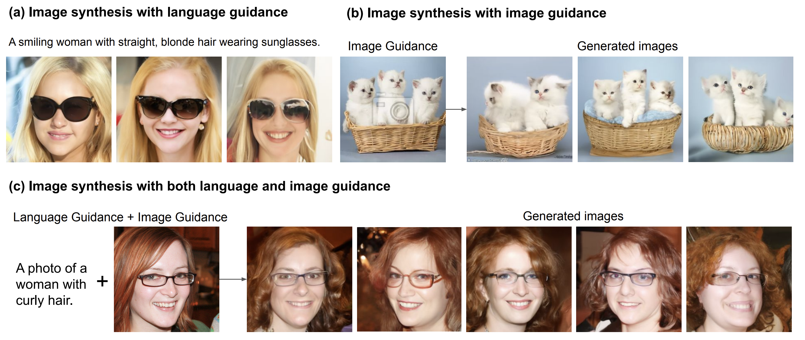

# More Control for Free! Image Synthesis with Semantic Diffusion Guidance

This is the codebase for [More Control for Free! Image Synthesis with Semantic Diffusion Guidance](http://arxiv.org/abs/2112.05744).

This repository is based on [openai/guided-diffusion](https://github.com/openai/guided-diffusion), with modifications for semantic guidance.



### Installation

```bash
git clone https://github.com/xh-liu/SDG_code
cd SDG
pip install -r requirements.txt
pip install -e .
```

### Download pre-trained models

The pretrained unconditional diffusion models are from [openai/guided-diffusion](https://github.com/openai/guided-diffusion) and [jychoi118/ilvr_adm](https://github.com/jychoi118/ilvr_adm).

 * LSUN bedroom unconditional diffusion: [lsun_bedroom.pt](https://openaipublic.blob.core.windows.net/diffusion/jul-2021/lsun_bedroom.pt)
 * LSUN cat unconditional diffusion: [lsun_cat.pt](https://openaipublic.blob.core.windows.net/diffusion/jul-2021/lsun_cat.pt)
 * LSUN horse unconditional diffusion: [lsun_horse.pt](https://openaipublic.blob.core.windows.net/diffusion/jul-2021/lsun_horse.pt)
 * LSUN horse (no dropout): [lsun_horse_nodropout.pt](https://openaipublic.blob.core.windows.net/diffusion/jul-2021/lsun_horse_nodropout.pt)
 * FFHQ unconditional diffusion: [ffhq.pt](https://onedrive.live.com/?authkey=%21AOIJGI8FUQXvFf8&id=72419B431C262344%21103807&cid=72419B431C262344)

We finetune the CLIP image encoders on noisy images for the semantic guidance. We provide the checkpoint as follows:

 * FFHQ semantic guidance: [clip_ffhq.pt](https://hkuhk-my.sharepoint.com/:u:/g/personal/xihuiliu_hku_hk/EQbpgLeWnZhBhNzvFXgn26IBhsveoX3V57ZoQdSsLnwrjA?e=1K0qwv)
 * LSUN bedroom semantic guidance: [clipbedroom.pt](https://hkuhk-my.sharepoint.com/:u:/g/personal/xihuiliu_hku_hk/EfVpSVSjAhlEpsBCxSwkBnQByUvgNZqr38bxnG6bDHuOZQ?e=bOgCZT)
 * LSUN cat semantic guidance: [clip_cat.pt](https://hkuhk-my.sharepoint.com/:u:/g/personal/xihuiliu_hku_hk/EQdhKa0Jte9FtaB21kRDbT0B7tI3SoZewOack9DNe8s0LQ?e=zILyOa)
 * LSUN horse semantic guidance: [clip_horse.pt](https://hkuhk-my.sharepoint.com/:u:/g/personal/xihuiliu_hku_hk/EWqcgeq4kkpCgi3S9WcsOjABScZg-gT-aSnaZyh1uHIxNg?e=qDUJWK)

### Sampling with semantic diffusion guidance

To sample from these models, you can use `scripts/sample.py`.
Here, we provide flags for sampling from all of these models.
We assume that you have downloaded the relevant model checkpoints into a folder called `models/`.

For LSUN cat, LSUN horse, and LSUN bedroom, the model flags are defined as:

```bash
MODEL_FLAGS="--attention_resolutions 32,16,8 --class_cond False --diffusion_steps 1000 --dropout 0.1 --image_size 256 --learn_sigma True --noise_schedule linear --num_channels 256 --num_head_channels 64 --num_res_blocks 2 --resblock_updown True --use_fp16 False --use_scale_shift_norm True --model_path models/lsun_bedroom.pt"
```

For FFHQ dataset, the model flags are defined as:
```bash
MODEL_FLAGS="--attention_resolutions 16 --class_cond False --diffusion_steps 1000 --dropout 0.0 --image_size 256 --learn_sigma True --noise_schedule linear --num_channels 128 --num_head_channels 64 --num_res_blocks 1 --resblock_updown True --use_fp16 False --use_scale_shift_norm True --model_path models/ffhq_10m.pt"
```

Sampling flags:

```bash
SAMPLE_FLAGS="--batch_size 8 --timestep_respacing 100"
```

Sampling with image content(semantics) guidance:

```bash
GUIDANCE_FLAGS="--data_dir ref/ref_bedroom --text_weight 0 --image_weight 100 --image_loss semantic --clip_path models/CLIP_bedroom.pt"
CUDA_VISIBLE_DEVICES=0 python -u scripts/sample.py --exp_name bedroom_image_guidance --single_gpu $MODEL_FLAGS $SAMPLE_FLAGS $GUIDANCE_FLAGS
```

Sampling with image style guidance:
```bash
GUIDANCE_FLAGS="--data_dir ref/ref_bedroom --text_weight 0 --image_weight 100 --image_loss style --clip_path models/CLIP_bedroom.pt"
CUDA_VISIBLE_DEVICES=0 python -u scripts/sample.py --exp_name bedroom_image_style_guidance --single_gpu $MODEL_FLAGS $SAMPLE_FLAGS $GUIDANCE_FLAGS
```

Sampling with language guidance:
```bash
GUIDANCE_FLAGS="--data_dir ref/ref_bedroom --text_weight 160 --image_weight 0 --text_instruction_file ref/bedroom_instructions.txt --clip_path models/CLIP_bedroom.pt"
CUDA_VISIBLE_DEVICES=0 python -u scripts/sample.py --exp_name bedroom_language_guidance --single_gpu $MODEL_FLAGS $SAMPLE_FLAGS $GUIDANCE_FLAGS
```

Sampling with both language and image guidance:
```bash
GUIDANCE_FLAGS="--data_dir ref/ref_bedroom --text_weight 160 --image_weight 100 --image_loss semantic --text_instruction_file ref/bedroom_instructions.txt --clip_path models/CLIP_bedroom.pt"
CUDA_VISIBLE_DEVICES=0 python -u scripts/sample.py --exp_name bedroom_image_language_guidance --single_gpu $MODEL_FLAGS $SAMPLE_FLAGS $GUIDANCE_FLAGS
```
You may need to adjust the text_weight and image_weight for better visual quality of generated samples.

### Citation
If you find our work useful for your research, please cite our papers.
```
@inproceedings{liu2023more,
  title={More control for free! image synthesis with semantic diffusion guidance},
  author={Liu, Xihui and Park, Dong Huk and Azadi, Samaneh and Zhang, Gong and Chopikyan, Arman and Hu, Yuxiao and Shi, Humphrey and Rohrbach, Anna and Darrell, Trevor},
  booktitle={Proceedings of the IEEE/CVF Winter Conference on Applications of Computer Vision},
  year={2023}
}
```

